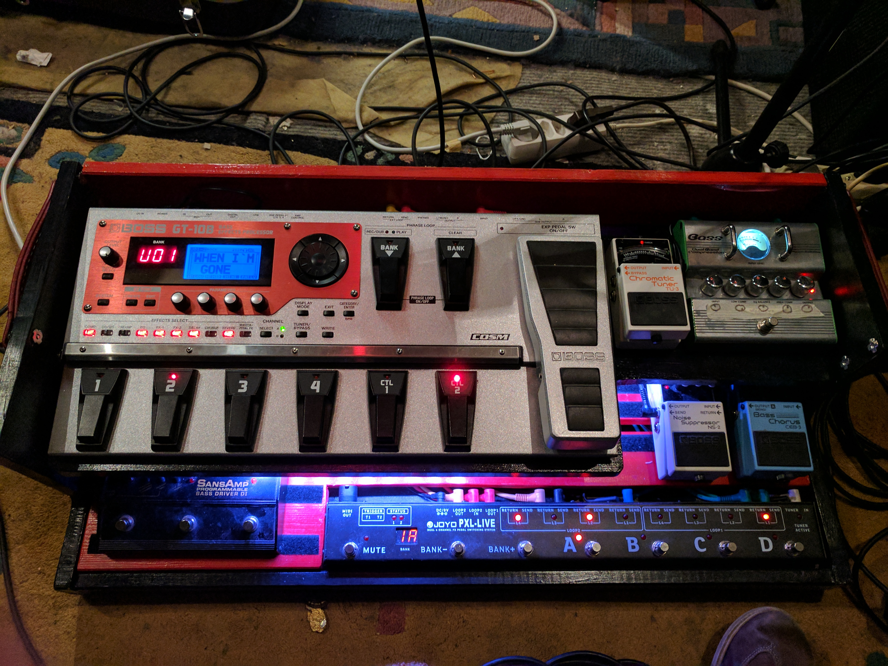

# MIDI Loop Switch
Dieses Projekt soll die Entwicklung meines selbstgebauten Rack Loop Switchs dokumentieren.

> **Hinweis zu Affiliate Links**
> *Die mit Sternchen (\*) gekennzeichneten Verweise sind sogenannte Provision-Links. Wenn du auf so einen Verweislink klickst und über diesen Link einkaufst, bekomme ich von deinem Einkauf eine Provision. Für dich verändert sich der Preis nicht. [Quelle: affima.de]*
> *Artikel von AZDelivery wären auch über Amazon beziehbar, kosten hier aber mehr als direkt beim Anbieter. Hier habe ich zugunsten des günstigeren Preises auf Affiliate Links verzichtet.*

## Die Idee
Mein Pedalboard war über kurze Zeit sehr schnell auf ein Maß angewachsen, dass es ersten zu groß für kleine Bühnen und zweitens zu schwer für meinen Rücken geworden war. Mit selbstgebautem Holzgehäuse hat das Board mehr als 25 Kilo auf die Waage gebracht.

Ich hatte schon lange eine rackbasierte Lösung ins Auge gefasst, wollte allerdings nicht auf den Komfort von programmierbaren Presets verzichten, wie ich es durch mein [Joyo PXL Pro](https://www.amazon.de/PXL-PRO-Loop-Effekt-Pedal-Switching-System-Schalt/dp/B00HQCXH2I) kannte.

Meine Suche nach passenden Geräten führte mich zu verschiedenen Loop Switches, die preislich für ein 8-Loop-Gerät  dann aber doch bei über 400€ liegen. Als Softwareentwickler, der kurz zuvor ein Interesse an der Entwicklung mit [Arduinos](https://de.wikipedia.org/wiki/Arduino_(Plattform)) gewonnen hatte, kam der Gedanke, ob man sowas nicht auch selbst umsetzen könnte. 

Meine Recherche hat mich zu [einer Anleitung auf instructables.com](https://www.instructables.com/id/Arduino-based-8-loops-pedal-switcher/) geführt, in welcher auf die Schaltung der Relais eingegangen wird.

## Die Teileliste

### AZDelivery
* 2 x [8-fach Relais](https://www.az-delivery.de/products/8-relais-modul?_pos=5&_sid=b2d4005f2&_ss=r)
* 1 x [Arduino MEGA](https://www.az-delivery.de/products/mega-2560-r3-board-mit-atmega2560-100-arduino-kompatibel-ohne-usb-kabel?_pos=5&_sid=048ee497f&_ss=r). 
  Das Kernstück muss aufgrund der Anzahl der benötigten Pins und des Speicherplatzes ein MEGA sein.
* 1 x [SD Leser](https://www.az-delivery.de/products/copy-of-spi-reader-micro-speicherkartenmodul-fur-arduino?_pos=3&_sid=0e91e4698&_ss=r)
* 1 x [LCD Display](https://www.az-delivery.de/products/lcd-display-16x2-mit-blauem-hintergrund-und-i2c-converter-bundle)
* 1 x [Lochrasterplatten Set](https://www.az-delivery.de/products/pcb-board-set-lochrasterplatte-platine-leiterplatte-4x4-stuck?_pos=1&_sid=3b0f9f2cc&_ss=r)
* 2 x [220V zu 5V Netzteil](https://www.az-delivery.de/products/copy-of-220v-zu-5v-mini-netzteil?_pos=3&_sid=3cbbc4fa6&_ss=r)

### Conrad
* 8 x [Taster mit integrierter LED](https://www.conrad.de/de/p/weltron-604108-drucktaster-12-v-0-03-a-1-x-aus-ein-tastend-1-st-709174.html?fbclid=IwAR3CLZ_HrAF_mJMgCVkBwPpbMwNBtUczKQQtddJHndXkT5E93Y2_mmiQ90w)
* 2 x [Drucktaster](https://www.conrad.de/de/p/eledis-sed1ui-2-drucktaster-20-v-dc-ac-0-02-a-1-x-aus-ein-tastend-1-st-705089.html)
* 1 x [Kaltgerätebuchse](https://www.conrad.de/de/p/kaiser-kaltgeraete-steckverbinder-stecker-einbau-vertikal-gesamtpolzahl-2-pe-10-a-schwarz-1-st-612600.html)

### Thomann
* 1 x [Neutrik USB Buchse](https://www.thomann.de/de/neutrik_nausb.htm)
* 1 x [2 HE Leergehäuse](https://www.thomann.de/de/adam_hall_87408v_leergehaeuse_2he.htm)
* 1 x [MIDI Einbaubuchse](https://www.thomann.de/de/thomann_midi_einbaubuchse.htm) 
  (Zwei, wenn auch gleichzeitig ein MIDI Out umgesetzt werden soll.)

### Amazon
* 1 x [Sparkfun MIDI Shield](https://www.amazon.de/dp/B004G52ONG/ref=cm_sw_r_wa_apa_i_Aj8aEbGEWFYZ1)
* 18 x [Klinkenbuchsen](https://www.amazon.de/gp/product/B003WGN3JY/ref=ppx_yo_dt_b_asin_title_o08_s00?ie=UTF8&psc=1). Das können natürlich auch andere sein.

### Zusätzlich wird benötigt
* Lötkolben
* Lötzinn
* Kupferlitze
* 8 Widerstände 110Ω für die LED
* [Jumperkabel](https://www.az-delivery.de/products/3er-set-40-stk-jumper-wire-m2m-f2m-f2f) sowie [Pins und Buchsen](https://www.amazon.de/Aussel-Breakaway-Platine-Stecker-Buchsenleiste/dp/B01M69EA9O/ref=sr_1_3?__mk_de_DE=%C3%85M%C3%85%C5%BD%C3%95%C3%91&keywords=arduino+header&qid=1577366115&sr=8-3) für Arduino Shields. Diese gibt es teils auch in Gesamtpaketen.
* 1 x [SD Karte](https://www.amazon.de/gp/product/B001BNNZXO/ref=ppx_yo_dt_b_asin_title_o06_s00?ie=UTF8&psc=1). 
  Diese kann beliebig gewählt werden. Der erwartete Speicherplatz ist nicht so groß.
* Abstandsbolzen [M2](https://www.amazon.de/gp/product/B071HPDCK8/ref=ppx_yo_dt_b_asin_title_o00_s00?ie=UTF8&psc=1) und [M3](https://www.amazon.de/gp/product/B01GO08KRO/ref=ppx_yo_dt_b_asin_title_o07_s00?ie=UTF8&psc=1). 
  Hier werden Exemplare aus Nylon wahrscheinlich genau so gut funktionieren.

## Der Aufbau
Generell habe ich versucht, meine Umsetzung so modular wie möglich aufzubauen. Das hat mir in der Entwicklung ermöglicht, einzelne Teile unabhängig voneinander zu testen. Zusätzlich gewährt es den Vorteil, dass Teile, die kaputt gehen, einfach und kostengünstig austauschbar sind.

### Relais

### MIDI Shield
Das MIDI Shield dient zur Kommunikation mit dem angeschlossenen MIDI Controller. Es empfängt die Daten und lässt sie über die Library einfach auswerten.
Ich habe mich für das Shield von Sparkfun entschieden, da es hierzu [eine sehr gute Dokumentation](https://learn.sparkfun.com/tutorials/midi-shield-hookup-guide) gibt. 
Für meinen Fall mussten auch nicht alle Teile des Shields zusammengebaut werden. Es reicht, die MIDI Buchse, die ich bei Thomann bestellt hatte, an die entsprechenden PINs zu löten.

#### Achtung: RUN vs PROG

*Bildlizenz: [CC BY-SA 4.0](https://creativecommons.org/licenses/by-sa/4.0/), Quelle: [Hookup Guide](https://learn.sparkfun.com/tutorials/midi-shield-hookup-guide)*

### SD Karte

### Das LCD Display

### Bedienknöpfe

### Stromversorgung

### Einbau in das Gehäuse
